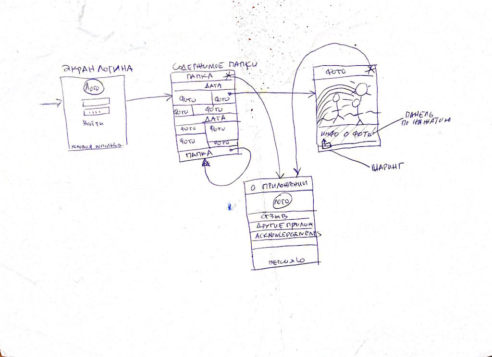

# Merry-go-round

Приложение для просмотра фотографий из вашего Dropbox

## Функциональность

Приложение может:

* Логиниться в учетку на Dropbox
* Загружать и парсить список файлов из выбранной папки
* Отображать все найденные фотографии
* По нажатию на фотографию открывается полная версия для просмотра
* Доступна информация о файле
* Фотографией можно поделиться через стандартное меню шаринга iOS

Приложение будеть уметь:

* Загружать и парсить список файлов (всех сразу)
* Отображать все найденные фотографии в виде красивого списка миниатюр
* Показывать дополнительную информацию о фото, которую можно получить из анализа самого изображения
* Снять или выбрать из библиотеки фото и загрузить в Dropbox
* Еще будет экран "О приложении", откуда можно будет отправить обратную связь
* Показывать места съемки фото на карте

## Пользовательский интерфейс

Будет выглядеть примерно так:

## Автор

Николай Морев, n.morev@corp.mail.ru

## License

Merry-go-round is available under the MIT license. See the LICENSE file for more info.

